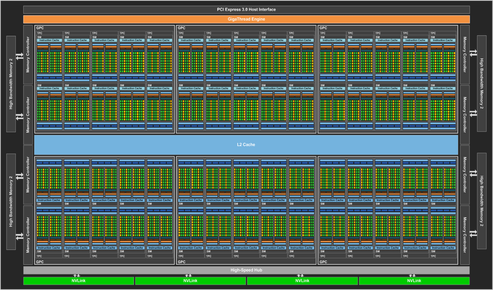
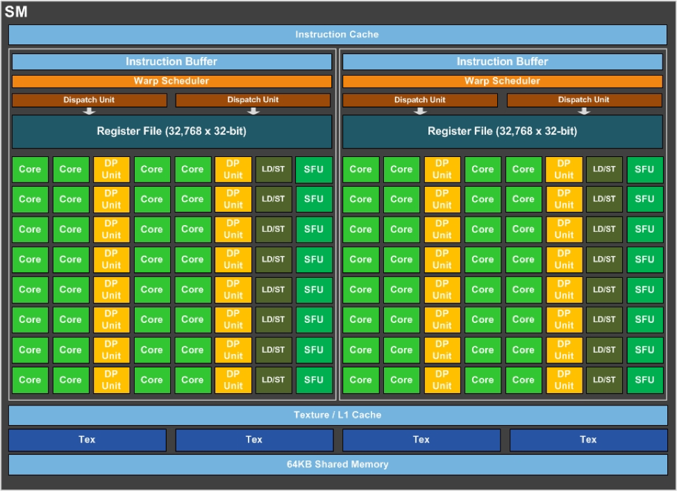

# CUDA Introduction

## Motivation

* จำนวนหน่วยประมวลผลใน Graphic Card มีจำนวนมาก 

| GPU                         | CUDA cores    | Memory | Processor frequency  |
| --------------------------- |:-------------:|:------:| :--------------------:|
| GeForce GTX 1080 Ti| 3584 | 11 GB| 1582|
| GeForce GTX TITAN X| 3072 | 12 GB| 1000 / 1075|
| GeForce GTX 1080| 2560 | 8 GB| 1607 / 1733|
| GeForce GTX 780| 2304 | 3 GB| 863 / 900|

* พลังการประมวลผลสูง และใช้ไฟต่ำ
* เกิดแนวคิดในการนำ Graphic Card มาใช้ประมวลผลโปรแกรมทั่วไป เรียกว่า GPGPU (General-Purpose computing on Graphics Processing Units)

## CUDA

* เป็น Platform และ Programming Model ของ NVIDIA ที่พัฒนาขึ้นเพื่อให้ Graphic Card ของ NVIDIA สามารถประมวลผลงานทั่วไปได้ (นอกเหนือจากงานด้าน Graphic)
* ประกอบด้วย
  * Programming Model และ Compiler (NVCC) สำหรับพัฒนาโปรแกรม
  * Runtine API
  * Library ต่างๆ เช่น cuBLAS, nvJPEG, nvGRAPH, cuSPARSE, cuFTT เป็นต้น
* ภาษาที่พัฒนาขึ้นในตอนแรกเป็น Extension ของภาษา C แต่ปัจจุบันสามารถใช้กับ C++ ได้
* ใช้ได้กับเฉพาะ Graphic Card ของ NVIDIA เท่านั้น (ทางเลือกอื่นคือ OpenCL ที่ใช้ได้กับหลาย vendor มากกว่า)

## NVIDIA GPU Architecture






ภาพจาก [PCWord](https://www.pcworld.com/article/3052222/components-graphics/nvidias-pascal-gpu-tech-specs-revealed-full-cuda-count-clock-speeds-and-more.html)

## Terminology

* Host
* Device
* Kernel
* Grid
* Thread Block

## Application ที่เหมาะสม

* High Throughput, Low Latency

## รูปแบบการประมวลผล

1. Allocate Memory บน Device
2. Transfer ข้อมูลจาก Host ไปยัง Device
3. Kernel Call
4. Transfer ข้อมูลกลับจาก Device ไปยัง Host
5. Deallocate Memory บน Device

## CUDA Vector Addition

```C
float *a, *b, *c;
float *d_a, *d_b, *d_c;

// Allocate device memory for vector a, b and c
cudaMalloc((void**)&d_a, N * sizeof(float));
cudaMalloc((void**)&d_b, N * sizeof(float));
cudaMalloc((void**)&d_c, N * sizeof(float));

// Transfer data from host to device
cudaMemcpy(d_a, a, N * sizeof(float), cudaMemcpyHostToDevice);
cudaMemcpy(d_b, b, N * sizeof(float), cudaMemcpyHostToDevice);

// Call kernel
vecadd<<<>>>(d_a, d_b, d_c, N);

// Transfer data from device to host
cudaMemcpy(c, d_c, N * sizeof(float), cudaMemcpyDeviceToHost);

// Deallocate device memory
cudaFree(d_a);
cudaFree(d_b);
cudaFree(d_c);
```

Kernel

```
__global__ void vecadd(float *a, float *b, float *c, int N) {
  int i = blockIdx.x * blockDim.x + threadIdx.x;
  if (i < N) c[i] = a[i] + b[i];
}
```

## Function modifiers

* `__host__` เรียกได้จาก Host และรันบน Host
* `__global__` เรียกได้จาก Host และรันบน Device
* `__device__` เรียกได้จาก Device และรันบน Device


## Memory Hierarchy

* Global Memory
* Local Memory
* Shared Memory
* Constant Memory
* Texture and Surface Memory


## CUDA Parallel Reduction


## Compute Capability

https://en.wikipedia.org/wiki/CUDA (Version features and specifications)

## Multiple GPUs Management

* `cudaGetDeviceCount(int *count)`
* `cudaSetDevice(int device)`
* `cudaGetDevice(int device)`
* `cudaGetDeviceProperties(cudaDeviceProp *prop, int device)`

## ทางเลือกอื่นสำหรับ GPU Programming

* OpenCL
* OpenACC
* OpenMP
* NVIDIA Thrust
* Microsoft C++ AMP