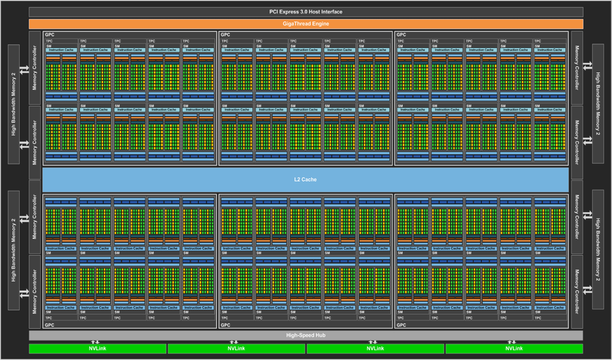
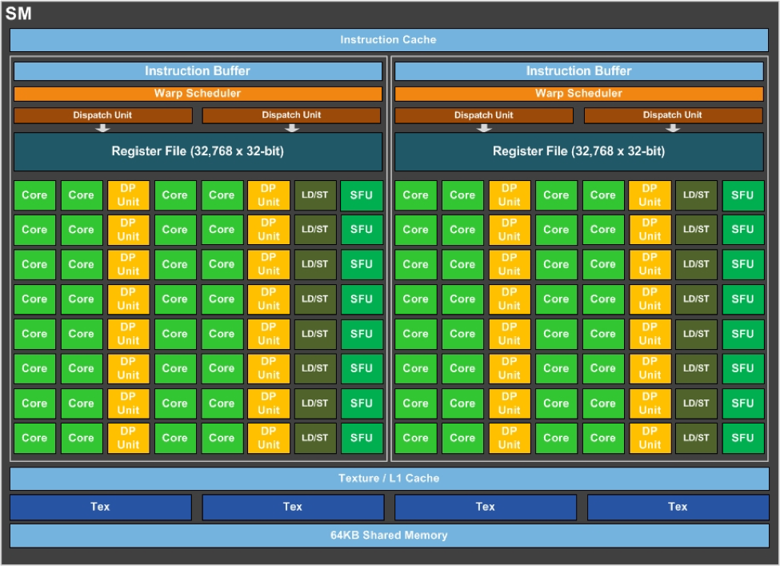

# CUDA Introduction

## Motivation

* จำนวนหน่วยประมวลผลใน Graphic Card มีจำนวนมาก 

| GPU                         | CUDA cores    | Memory | Processor frequency  |
| --------------------------- |:-------------:|:------:| :--------------------:|
| GeForce GTX 1080 Ti| 3584 | 11 GB| 1582|
| GeForce GTX TITAN X| 3072 | 12 GB| 1000 / 1075|
| GeForce GTX 1080| 2560 | 8 GB| 1607 / 1733|
| GeForce GTX 780| 2304 | 3 GB| 863 / 900|

* พลังการประมวลผลสูง และใช้ไฟต่ำ
* เกิดแนวคิดในการนำ Graphic Card มาใช้ประมวลผลโปรแกรมทั่วไป เรียกว่า GPGPU (General-Purpose computing on Graphics Processing Units)

## CUDA

* เป็น Platform และ Programming Model ของ NVIDIA ที่พัฒนาขึ้นเพื่อให้ Graphic Card ของ NVIDIA สามารถประมวลผลงานทั่วไปได้ (นอกเหนือจากงานด้าน Graphic)
* ประกอบด้วย
  * Programming Model และ Compiler (NVCC) สำหรับพัฒนาโปรแกรม
  * Runtine API
  * Library ต่างๆ เช่น cuBLAS, nvJPEG, nvGRAPH, cuSPARSE, cuFTT เป็นต้น
* ภาษาที่พัฒนาขึ้นในตอนแรกเป็น Extension ของภาษา C แต่ปัจจุบันสามารถใช้กับ C++ ได้
* ใช้ได้กับเฉพาะ Graphic Card ของ NVIDIA เท่านั้น (ทางเลือกอื่นคือ OpenCL ที่ใช้ได้กับหลาย vendor มากกว่า)

## NVIDIA GPU Architecture

Pascal GP100



* 60 SMs (Streaming Multiprocessors)
* 30 TPCs
* มี Memmory แยกจาก Main Memory ของ CPU



* 64 CUDA Cores
* 64KB On-chip Shared Memory (High Bandwidth)

GPU จึงเหมาะกับ

* โปรแกรมแบบ Data Parallelism
* งานที่ต้องการ Throughput สูง
* เวลาที่ใช้ Compute ควรจะสูงกว่า Transfer มากๆ

## Terminology

* Host - CPU และ Main Memory ของเครื่องที่ใช้รัน
* Device - GPU และ Memory ของ GPU
* Kernel - ฟังก์ชันที่ทำงานบน Device โดยเรียกใช้งานจาก Host
* Streaming Multiprocessors (SM) - กลุ่มของ Processor ที่ประมวลผลคำสั่งเดียวกัน หรือ SIMT (Single Instruction Multiple Threads)
* Thread Block - กลุ่มของ Threads ที่รันอยู่บน SM เดียวกัน
* Grid - กลุ่มของ Thread Block
* Warp - กลุ่มของ Thread ที่ประมวลผลพร้อมกัน บน Hardware เป็นหน่วยย่อยที่สุดของการ Schedule ใน NVIDIA GPU


## deviceQuery

ใน CUDA Toolkit จะมีโปรแกรมตัวอย่างเริ่มต้นมากมายที่สามารถดูเพื่อทำความเข้าใจ CUDA ได้ โปรแกรมตัวหนึ่งมีชื่อว่า deviceQuery ที่แสดงข้อมูลต่าง ๆ ของ GPU ของเราออกมาได้ ซึ่งจะอยู่ที่ `$CUDA_TOOLKIT_PATH/NVIDIA_CUDA-x.x_Samples/1_Utilities/deviceQuery`

```
./deviceQuery Starting...

 CUDA Device Query (Runtime API) version (CUDART static linking)

Detected 2 CUDA Capable device(s)

Device 0: "Tesla K40c"
  CUDA Driver Version / Runtime Version          10.0 / 9.0
  CUDA Capability Major/Minor version number:    3.5
  Total amount of global memory:                 12207 MBytes (12799574016 bytes)
  (15) Multiprocessors, (192) CUDA Cores/MP:     2880 CUDA Cores
  GPU Max Clock rate:                            745 MHz (0.75 GHz)
  Memory Clock rate:                             3004 Mhz
  Memory Bus Width:                              384-bit
  L2 Cache Size:                                 1572864 bytes
  Maximum Texture Dimension Size (x,y,z)         1D=(65536), 2D=(65536, 65536), 3D=(4096, 4096, 4096)
  Maximum Layered 1D Texture Size, (num) layers  1D=(16384), 2048 layers
  Maximum Layered 2D Texture Size, (num) layers  2D=(16384, 16384), 2048 layers
  Total amount of constant memory:               65536 bytes
  Total amount of shared memory per block:       49152 bytes
  Total number of registers available per block: 65536
  Warp size:                                     32
  Maximum number of threads per multiprocessor:  2048
  Maximum number of threads per block:           1024
  Max dimension size of a thread block (x,y,z): (1024, 1024, 64)
  Max dimension size of a grid size    (x,y,z): (2147483647, 65535, 65535)
  Maximum memory pitch:                          2147483647 bytes
  Texture alignment:                             512 bytes
  Concurrent copy and kernel execution:          Yes with 2 copy engine(s)
  Run time limit on kernels:                     No
  Integrated GPU sharing Host Memory:            No
  Support host page-locked memory mapping:       Yes
  Alignment requirement for Surfaces:            Yes
  Device has ECC support:                        Disabled
  Device supports Unified Addressing (UVA):      Yes
  Supports Cooperative Kernel Launch:            No
  Supports MultiDevice Co-op Kernel Launch:      No
  Device PCI Domain ID / Bus ID / location ID:   0 / 3 / 0
  Compute Mode:
     < Default (multiple host threads can use ::cudaSetDevice() with device simultaneously) >

...
```

## Execution Flow

การเขียนโปรแกรมเพื่อทำงานบน GPU จะมีขั้นตอนที่ซับซ้อนเพื่อขึ้นจากการที่ Memory ของ GPU แยกจาก Main Memory จึงจะต้องทำการ Allocate พื้นที่ก่อนใช้งาน และ Transfer ข้อมูลไปกลับระหว่าง Host และ Device

ขั้นตอนโดยทั่วไปจะเป็น

1. Allocate Memory บน Device
2. Transfer ข้อมูลจาก Host ไปยัง Device
3. Kernel Call
4. Transfer ข้อมูลกลับจาก Device ไปยัง Host
5. Deallocate Memory บน Device

## CUDA Vector Addition

ตัวอย่างโปรแกรมบวก Vector a และ b เข้าด้วยกัน โดยใช้ CUDA

```C
float *a, *b, *c;
float *d_a, *d_b, *d_c;
int vecSize = N * sizeof(float);

a = (float*)malloc(vecSize);
b = (float*)malloc(vecSize);
c = (float*)malloc(vecSize);

// Allocate device memory for vector a, b and c
cudaMalloc((void**)&d_a, vecSize);
cudaMalloc((void**)&d_b, vecSize);
cudaMalloc((void**)&d_c, vecSize);

// Transfer data from host to device
cudaMemcpy(d_a, a, vecSize, cudaMemcpyHostToDevice);
cudaMemcpy(d_b, b, vecSize, cudaMemcpyHostToDevice);

// Call kernel
int threadsPerBlock = 256;
int numBlocks = ceil(N * 1.0 / threadsPerBlock);
vecadd<<<numBlocks, threadsPerBlock>>>(d_a, d_b, d_c, N);

// Transfer data from device to host
cudaMemcpy(c, d_c, vecSize, cudaMemcpyDeviceToHost);

// Deallocate device memory
cudaFree(d_a);
cudaFree(d_b);
cudaFree(d_c);

free(a); free(b); free(c);
```

Kernel

```
__global__ void vecadd(float *a, float *b, float *c, int N) {
  int i = blockIdx.x * blockDim.x + threadIdx.x;
  if (i < N) c[i] = a[i] + b[i];
}
```

Thread Per Grid และ Thread Per Block สามารถกำหนดได้หลายมิติ (สูงสุดคือ 3)

## Function modifiers

* `__host__` เรียกได้จาก Host และรันบน Host
* `__global__` เรียกได้จาก Host และรันบน Device
* `__device__` เรียกได้จาก Device และรันบน Device

## Memory Hierarchy

* Global Memory - มองเห็นได้จากทั้ง Host และ Device ใช้สำหรับส่งข้อมูลไปกลับระหว่าง Host และ Device ทุก Thread สามารถมองเห็นได้ทั้งหมด
* Local Memory - มองเห็นได้เฉพาะใน Thread เท่านั้น
* Shared Memory - มองเห็นได้จากใน Thread Block เดียวกัน มีความเร็วสูงกว่า Global Memory
* Register - มองเห็นได้เฉพาะใน Thread เท่านั้น มีความเร็วสูง แต่มีขนาดจำกัด
* Constant Memory - แก้ไขไม่ได้ใน Kernel (อ่านได้อย่างเดียว) คุณสมบัติเหมือน Global Memory แต่มี Cached


## Moving Average (Low-pass filter)

|  in  |  0  |  1  |  2  |  3  |  4  |  5  |  6  |  7  | ... | N-1 |  N  |
|------|-----|-----|-----|-----|-----|-----|-----|-----|-----|-----|-----|
| out  |  -  |  0  |  1  |  2  |  3  |  4  |  5  | ... | N-3 | N-2 |  -  |

Sequential Code

```C
void moving_average(float *in, float *out, int N) {
  for (int i = 1; i < N-1; i++) {
    out[i] = (in[i] + in[i+1] + in[i+2]) / 3.0;
  }
}
```

CUDA Kernel (ในแต่ละ Thread มีการ Access Global Memory 3 ครั้ง)

```C
__global__ void moving_average(float *in, float *out) {
  int i = blockIdx.x * blockDim.x + threadIdx.x;
  if (i < N-2) {
    out[i] = (in[i] + in[i+1] + in[i+2]) / 3.0;
  }
}
```

Optimized Version

```C
__global__ void moving_average(float *in, float *out) {
  int i = blockIdx.x * blockDim.x + threadIdx.x;
  int tid = threadIdx.x;
  __shared__ float temp[BLOCKSIZE + 2];
  
  if (i < N-2) {
    temp[tid+2] = in[i];
    if (threadIdx.x == 0) {
      temp[0] = in[i-2];
      temp[1] = in[i-1];
    }
  }
  
  __syncthreads();
  
  if (i < N-2) {
    out[i] = (temp[tid] + temp[tid+1] + temp[tid+2]) / 3.0;
  }
}
```

## Debuging CUDA

* `cudaError_t cudaGetLastError(void)`
* `char *cudaGetErrorString(cudaError_t)`

## Multiple GPUs Management

* `cudaGetDeviceCount(int *count)` - คืนค่าจำนวน Device ในเครื่อง
* `cudaSetDevice(int device)` - กำหนด Device ที่จะทำงานด้วย
* `cudaGetDevice(int *device)` - คืนค่าหมายเลขของ Device ที่เลือกอยู่
* `cudaGetDeviceProperties(cudaDeviceProp *prop, int device)` - คืนค่าคุณสมบัติของ Device

## ทางเลือกอื่นสำหรับ GPU Programming

* [OpenCL](https://www.khronos.org/opencl/)
* [OpenACC](https://www.openacc.org/)
* [OpenMP](https://www.openmp.org/)
* [NVIDIA Thrust](https://developer.nvidia.com/thrust)
* [Microsoft C++ AMP](https://msdn.microsoft.com/en-us/library/hh265137.aspx)

## References

* https://docs.nvidia.com/cuda/cuda-c-programming-guide/
* https://en.wikipedia.org/wiki/CUDA (Version features and specifications)
* https://www.pcworld.com/article/3052222/components-graphics/nvidias-pascal-gpu-tech-specs-revealed-full-cuda-count-clock-speeds-and-more.html (รูปภาพ)